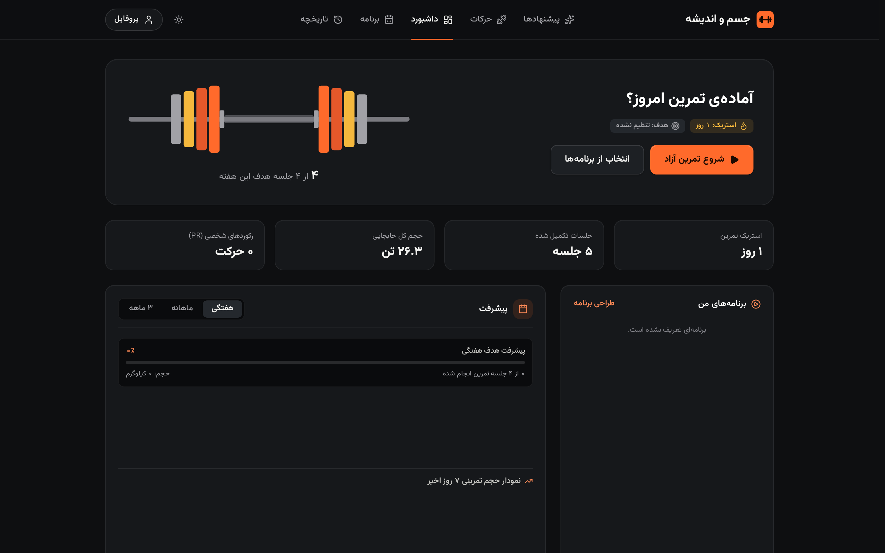
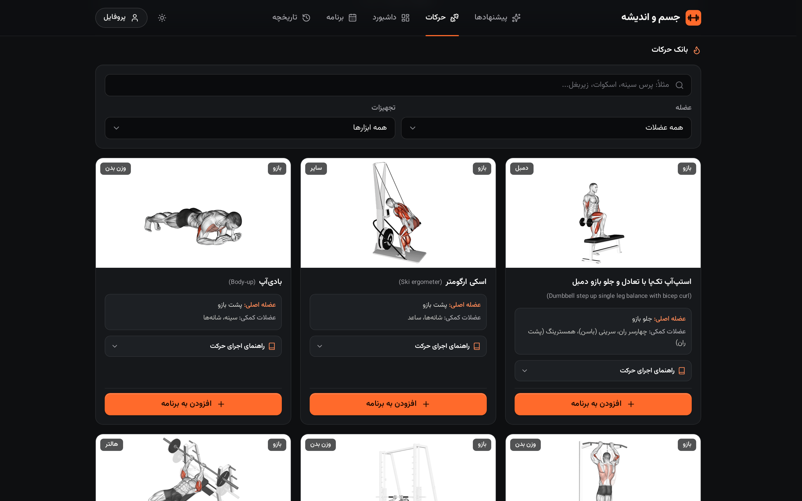
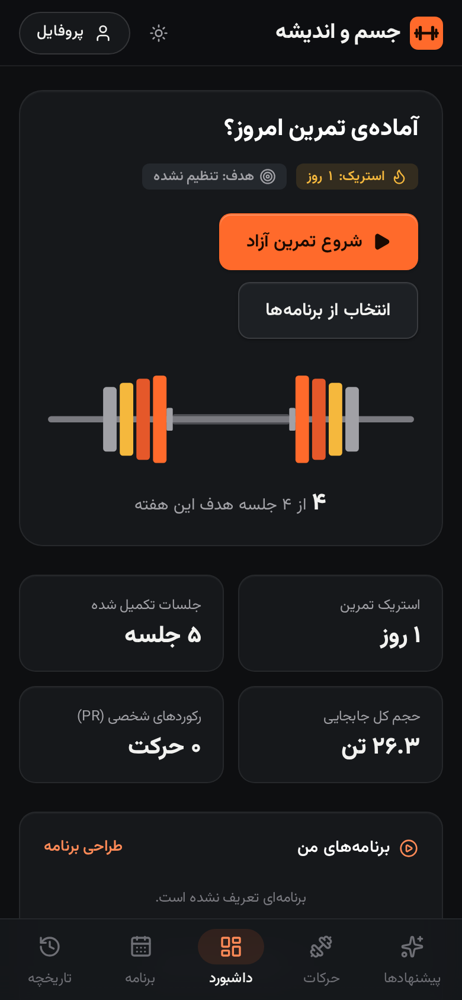
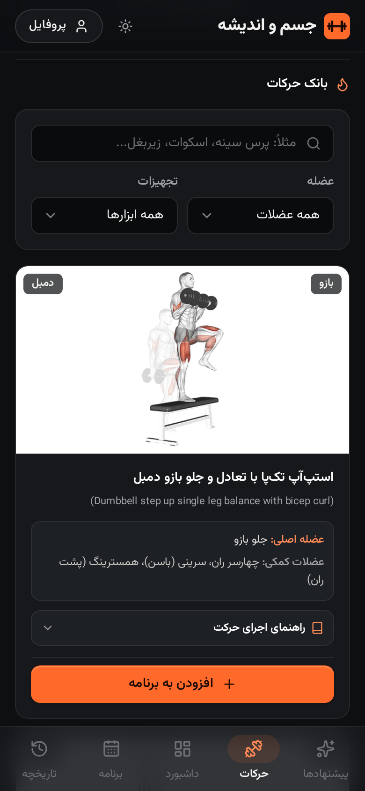
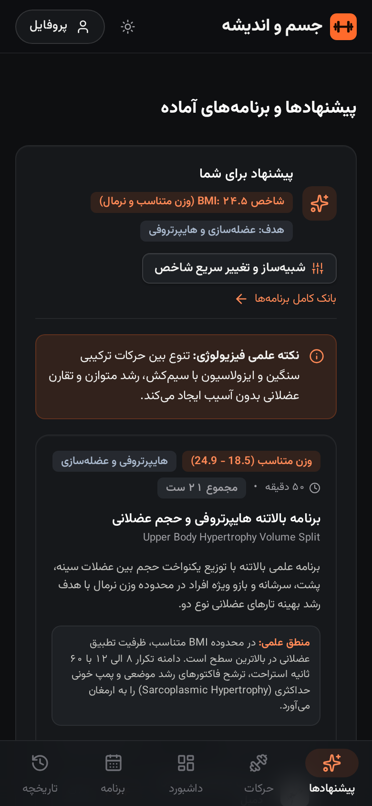
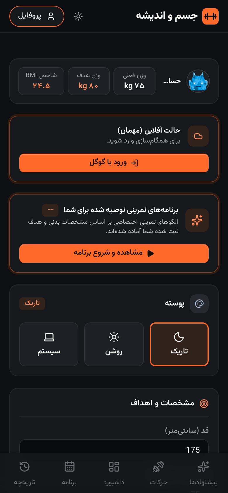

# CHTH Gym

[](https://opensource.org/licenses/MIT)

A comprehensive cloud-based workout tracker, smart routine planner, and fitness analytics platform built for **Cloudflare Workers** with **Hono**, **Cloudflare D1 (SQLite)**, **Cloudflare KV**, **Google OAuth 2.0**, and a modern dark-mode-first RTL interface.

---

## Features

- **Exercise Library & Animated Guides** — 68 curated exercises with animated GIFs and Persian instructions, plus 1,200+ library movements with muscle maps and English instructions
- **Routine Builder** — Create and customize workout splits (Push/Pull/Legs, Upper/Lower) with target sets, reps, and rest periods
- **Active Workout Tracker** — Live stopwatch, rest interval countdown with audio alerts, PR and estimated-1RM detection, plate calculator and warm-up ramp for barbell lifts
- **Analytics Dashboard** — Training volume charts, consistency streak tracker, PR hall of fame with estimated 1RM, and a muscle recovery body map
- **Google OAuth** — Secure authentication via Google OpenID Connect
- **RTL & Persian Support** — Full RTL layout with Persian numerals and Solar Hijri calendar

---

## Screenshots





| Dashboard | Exercise library | Suggestions | Profile |
|---|---|---|---|
|  |  |  |  |

---

## Tech Stack

| Layer | Technology |
|---|---|
| Backend | Hono (Cloudflare Workers) |
| Database | Cloudflare D1 (SQLite) |
| Cache | Cloudflare KV |
| Auth | Google OAuth 2.0 (OpenID Connect) |
| Frontend | HTML5, Tailwind CSS, Chart.js, Vazirmatn |

---

## Quick Start

### Prerequisites

- [Node.js](https://nodejs.org/) 18+
- [npm](https://www.npmjs.com/) (the repo ships a `package-lock.json`)
- A [Cloudflare](https://www.cloudflare.com/) account (for D1 and KV)

### Installation

```bash
# Clone the repository
git clone https://github.com/chethober/chth.gym.git
cd chth.gym

# Install dependencies
npm install

# Start the dev server
npm run dev
```

### Database Setup

```bash
# Apply migrations locally
npm run d1:migrate:local

# Apply migrations remotely
npm run d1:migrate:remote
```

### Google OAuth Setup

1. Create an OAuth 2.0 project in the [Google Cloud Console](https://console.cloud.google.com/)
2. Configure the following variables in `wrangler.jsonc` or via `wrangler secret put`:
   - `GOOGLE_CLIENT_ID`
   - `GOOGLE_CLIENT_SECRET`
   - `REDIRECT_URI` (e.g., `https://chth.gym/api/auth/google/callback`)

> **Note:** For quick local testing without Google credentials, a Demo Mode authentication bypass is enabled by default.

### Deploy

```bash
npm run deploy
```

---

## Project Structure

```
├── migrations/          # D1 migrations (schema, seed data, exercise library, weekly plan)
├── src/
│   ├── auth/           # Google OAuth & session management
│   ├── data/           # Preloaded workout programs
│   ├── db/             # D1 database queries
│   ├── frontend/       # SPA frontend (HTML, Tailwind, JS) rendered by the worker
│   ├── lib/            # Domain logic (strength/e1RM, muscle recovery)
│   ├── routes/         # API route handlers
│   ├── types.ts        # TypeScript interfaces
│   └── index.ts        # Main Hono worker entry point
├── scripts/            # Dataset build scripts and Persian translations
├── public/             # Static assets (exercise GIFs, icons)
├── docs/screenshots/   # README screenshots
└── wrangler.jsonc      # Cloudflare Workers configuration
```

---

## Configuration

### Environment Variables

| Variable | Description |
|---|---|
| `GOOGLE_CLIENT_ID` | Google OAuth client ID |
| `GOOGLE_CLIENT_SECRET` | Google OAuth client secret |
| `REDIRECT_URI` | OAuth callback URL |

### Cloudflare Wrangler Configuration

Update `wrangler.jsonc` with your Cloudflare resource IDs:

```jsonc
{
  "d1_databases": [
    {
      "binding": "DB",
      "database_name": "chth-gym-db",
      "database_id": "<YOUR_D1_DATABASE_ID>",
      "migrations_dir": "migrations"
    }
  ],
  "kv_namespaces": [
    {
      "binding": "KV_SESSIONS",
      "id": "<YOUR_KV_NAMESPACE_ID>"
    }
  ],
  "routes": [
    { "pattern": "chth.gym", "custom_domain": true }
  ]
}
```

---

## Contributing

We welcome contributions! Please see [CONTRIBUTING.md](CONTRIBUTING.md) for guidelines.

## Code of Conduct

This project adheres to the [Contributor Covenant](CODE_OF_CONDUCT.md). By participating, you are expected to uphold this code.

## Security

Please report security vulnerabilities by opening a [private security advisory](https://github.com/chethober/chth.gym/security/advisories/new). See [SECURITY.md](SECURITY.md) for more details.

---

## License

Distributed under the [MIT License](LICENSE).

---

Third-party data (muscle outlines, exercise library) is credited in [NOTICE.md](NOTICE.md).
